<div align="center">
  
</div>

---


# About Me : 

 - I am a beginner programmer and I am still learning :)
 - From time to time I create projects and make them open source
 - I hope you find my projects useful and interesting

---

# What I Care About :

 -   🐍 Python Language
 -   🐧 Linux Enthusiast
 -   🔓 Open Source  
 -   🔒 Digital Privacy  
 -   💻 OS Enthusiast

---

# Featured Projects :

```python

# My Featured Projects :

projects = {

    "foss-banner" : "https://github.com/MohssineX/foss-banner",
    "pygeoterm" : "https://github.com/MohssineX/pygeoterm",
    "ram-monitor" : "https://github.com/MohssineX/ram-monitor",
    "multigenerator" : "https://github.com/MohssineX/multigenerator",
    "studytimer" : "https://github.com/MohssineX/studytimer",
    "quranPlayer" : "https://github.com/MohssineX/quranPlayer",

}

```
---


